# Extraction Survivors — Interaction Diagrams

---

## 1. Game State Machine

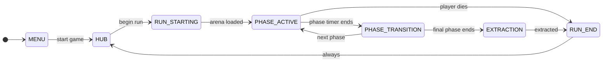

---

## 2. Autoload System Map

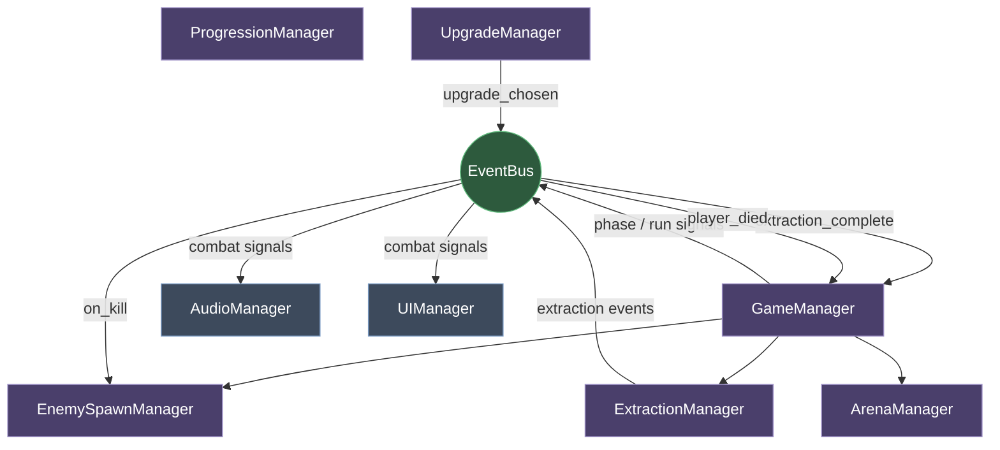

---

## 3. Scene Ownership — CombatOrchestrator

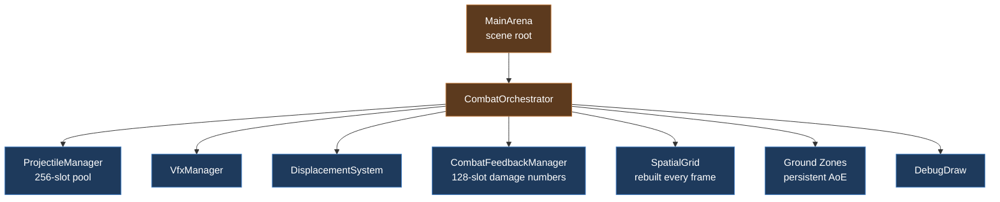

---

## 4. Entity Component Structure

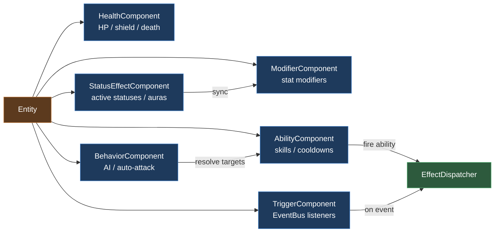

---

## 5. Per-Frame Tick Order

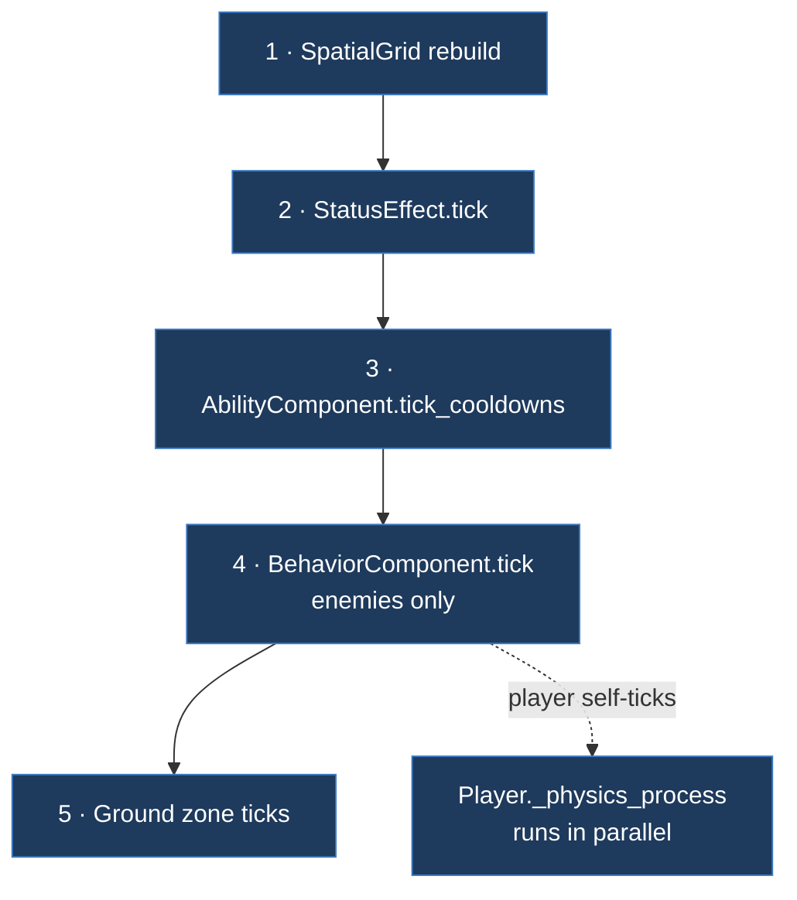

---

## 6. Damage Pipeline — 8 Steps

```mermaid
flowchart LR
    classDef step fill:#3d2020,stroke:#c45a5a,color:#fff
    classDef out fill:#2d5a3d,stroke:#5db87a,color:#fff

    S1[1 · Base damage<br/>+ attribute scaling]:::step
    S2[2 · Type conversion]:::step
    S3[3 · Offensive mods<br/>bonus for type + All]:::step
    S4[4 · Dodge check]:::step
    S5[5 · Block check<br/>+ mitigation]:::step
    S6[6 · Resistance<br/>raw × 1−R÷R+100]:::step
    S7[7 · Damage taken mods<br/>+ vulnerability]:::step
    S8[8 · Crit roll]:::step
    HD([HitData<br/>amount / type / flags]):::out

    S1 --> S2 --> S3 --> S4 --> S5 --> S6 --> S7 --> S8 --> HD
```

---

## 7. EffectDispatcher — Effect Types

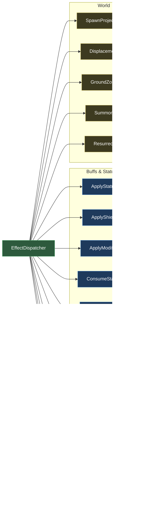

---

## 8. Kill Event — Full Sequence

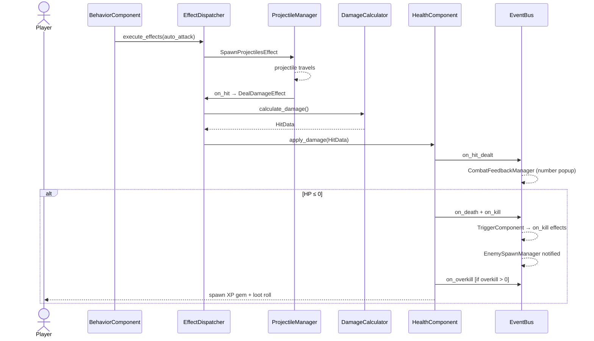

---

## 9. Status Effect Lifecycle

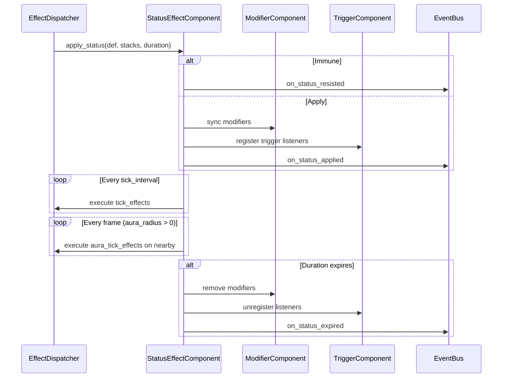

---

## 10. Targeting Resolution

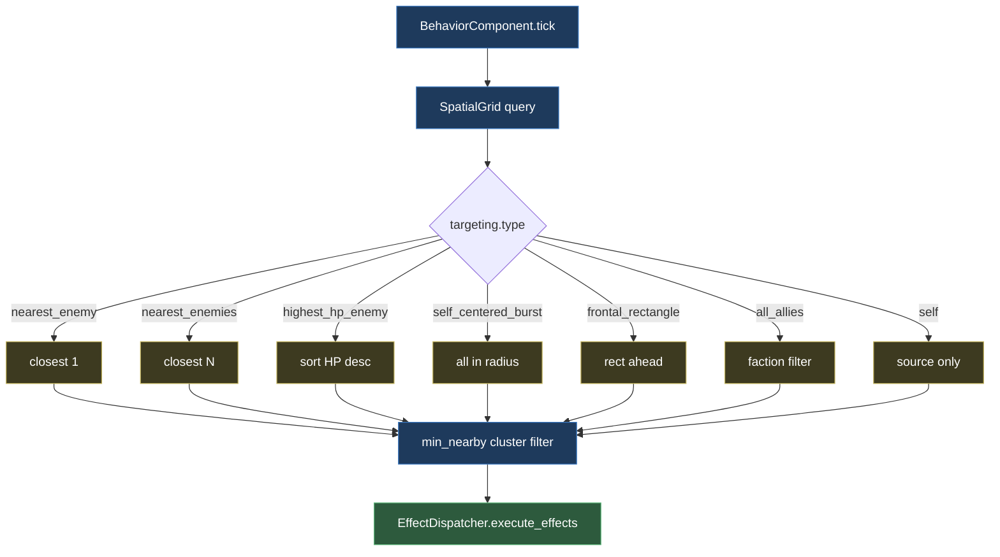

---

## 11. Modifier Query

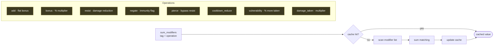

---

## 12. Extraction Flow

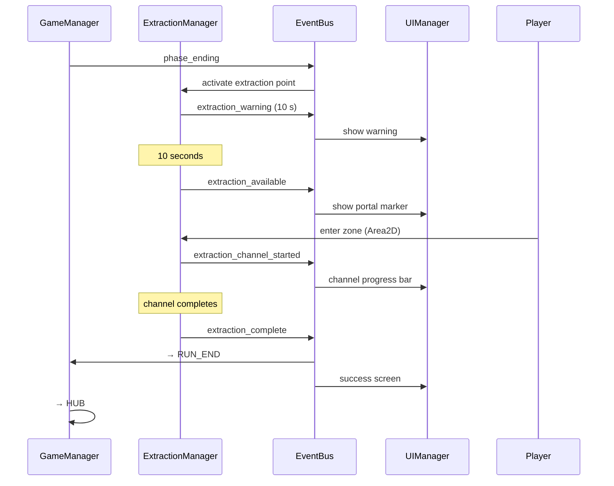

---

## 13. EventBus Signal Hub

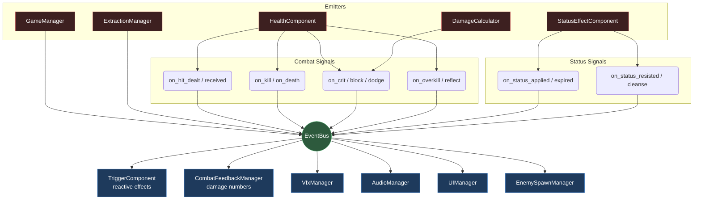
