# Weapon Scaling Reference

Two independent scaling axes: **Level-Up Upgrades** (player-wide stat boosts) and **Weapon Mods** (per-weapon behavior changes). Both affect every weapon, but mods interact differently depending on weapon behavior type.

---

## Weapons at a Glance

| Weapon | Behavior | Damage Type | Mod Slots | Notes |
|---|---|---|---|---|
| Hurled Steel | projectile | physical | 2 | Starter, never drops |
| Frost Scattergun | spread | cryo | 2 | 5 projectiles per shot |
| Ember Beam | beam | fire | 1 | 12 ticks/sec, 72 DPS base |
| Lightning Orb | orbit | shock | 1 | 3 orbiting orbs, passive |
| Void Mortar | artillery | void | 2 | 1s fuse, 64px AoE |
| Arcane Blade | melee | physical | 2 | 200° arc, 2.5 swings/sec — scales with mods |
| Warden's Repeater | projectile | physical | 2 | Slow, heavy — char exclusive |
| Spark's Pistol | projectile | physical | 1 | 2 shots/sec — char exclusive |
| Herald's Call | projectile | physical | 1 | Weak auto — char exclusive |

---

## Weapon × Mod Synergy

**Key:** ⭐ great synergy · ✓ works fine · ~ weak/marginal · — doesn't apply

| Mod | Hurled Steel | Scattergun | Ember Beam | Lightning Orb | Void Mortar | Arcane Blade | Repeater | Spark's | Herald's |
|---|:---:|:---:|:---:|:---:|:---:|:---:|:---:|:---:|:---:|
| **PIERCE** | ⭐ | ~ | — | — | — | — | ⭐ | ✓ | ✓ |
| **CHAIN** | ✓ | ~ | ✓ | ✓ | ~ | ✓ | ⭐ | ✓ | ✓ |
| **EXPLOSIVE** | ✓ | ⭐ | — | — | ~ | ~ | ⭐ | ✓ | ~ |
| **FIRE** | ✓ | ✓ | ~ | ✓ | ✓ | ✓ | ✓ | ✓ | ✓ |
| **CRYO** | ✓ | ~ | ✓ | ✓ | ⭐ | ⭐ | ⭐ | ✓ | ✓ |
| **SHOCK** | ✓ | ✓ | ✓ | ~ | ✓ | ✓ | ✓ | ✓ | ✓ |
| **LIFESTEAL** | ✓ | ⭐ | ⭐ | ✓ | ~ | ⭐ | ✓ | ⭐ | ~ |
| **SIZE** | ✓ | ⭐ | ~ | ⭐ | ⭐ | ⭐ | ✓ | ✓ | ✓ |
| **CRIT AMP** | ✓ | ✓ | ✓ | ✓ | ⭐ | ⭐ | ⭐ | ✓ | ~ |
| **INSTABILITY SIPHON** | ✓ | ⭐ | ✓ | ✓ | ✓ | ✓ | ✓ | ⭐ | ~ |
| **SPLIT** | ⭐ | ~ | — | — | — | — | ⭐ | ✓ | ✓ |
| **GRAVITY** | ⭐ | ~ | — | — | — | — | ⭐ | ✓ | ✓ |
| **RICOCHET** | ⭐ | ~ | — | — | — | — | ⭐ | ✓ | ✓ |
| **ACCELERATING** | ✓ | ✓ | ⭐ | ~ | — | ⭐ | ~ | ⭐ | ~ |
| **DOT APPLICATOR** | ✓ | ⭐ | ⭐ | ✓ | ~ | ⭐ | ✓ | ⭐ | ✓ |
| **MULTISHOT** | ✓ | ~ | ⭐ | ~ | ~ | — | ✓ | ✓ | ✓ |
| **NAPALM** | — | — | ⭐ | — | — | — | — | — | — |

> **Notes on — ratings:**
> - PIERCE / SPLIT / GRAVITY / RICOCHET only work on projectile-type weapons
> - EXPLOSIVE requires an impact point; beam/orbit/melee don't have one
> - NAPALM is functionally Ember Beam-exclusive (scorches beam path)
> - ACCELERATING requires sustained fire; artillery's slow fuse cycle doesn't benefit

---

## Level-Up Upgrade Pool

All upgrades are **player-wide** — they affect every weapon equally.

### Base Upgrades (17)

| ID | Display Name | Effect | Category |
|---|---|---|---|
| `damage_up` | Damage Up | +20% Damage | Offense |
| `crit_chance_up` | Critical Strike | +5% Crit Chance | Offense |
| `crit_damage_up` | Critical Power | +25% Crit Damage | Offense |
| `attack_speed_up` | Attack Speed Up | +15% Attack Speed | Offense |
| `projectile_count_up` | Multi Shot | +1 Projectile | Offense |
| `pierce_up` | Pierce | +1 Pierce | Offense |
| `projectile_size_up` | Bigger Shots | +25% Projectile Size | Offense |
| `max_hp_up` | Max HP Up | +20 Max HP | Defense |
| `armor_up` | Armor Up | +3 Armor | Defense |
| `move_speed_up` | Speed Up | +15% Move Speed | Utility |
| `pickup_radius_up` | Magnetism | +30% Pickup Radius | Utility |
| `bloodthirst` | Bloodthirst | On Kill: Heal 5% Max HP | Passive |
| `static_discharge` | Static Discharge | On Crit: Lightning AoE | Passive |
| `serrated_strikes` | Serrated Strikes | Hits apply Bleed | Passive |
| `adrenaline_rush` | Adrenaline Rush | On Kill: +25% Speed (3s) | Passive |
| `thorns_passive` | Thorns | Reflect 8 dmg when hit | Passive |
| `second_wind` | Second Wind | On Dodge: Heal 3% Max HP | Passive |

### Evolution Upgrades (11)

Evolutions replace their prerequisites when unlocked and appear as a guaranteed choice once requirements are met.

```mermaid
flowchart TD
    damage_up["Damage Up\n+20% DMG"]
    crit_chance_up["Critical Strike\n+5% Crit"]
    crit_damage_up["Critical Power\n+25% Crit DMG"]
    max_hp_up["Max HP Up\n+20 HP"]
    armor_up["Armor Up\n+3 Armor"]
    projectile_count_up["Multi Shot\n+1 Projectile"]
    attack_speed_up["Attack Speed Up\n+15% Spd"]
    move_speed_up["Speed Up\n+15% Move"]
    projectile_size_up["Bigger Shots\n+25% Size"]
    pickup_radius_up["Magnetism\n+30% Pickup"]
    pierce_up["Pierce\n+1 Pierce"]
    bloodthirst["Bloodthirst\nKill → Heal"]
    serrated_strikes["Serrated Strikes\nHits → Bleed"]
    adrenaline_rush["Adrenaline Rush\nKill → Speed"]
    static_discharge["Static Discharge\nCrit → AoE"]
    second_wind["Second Wind\nDodge → Heal"]

    glass_cannon(["⚡ GLASS CANNON\n+40% DMG, +10% Crit, -15 HP"])
    juggernaut(["🛡 JUGGERNAUT\n+40 HP, +5 Armor"])
    fortress(["🏰 FORTRESS\n+30 HP, +4 Armor, -10% Speed"])
    bullet_storm(["🔫 BULLET STORM\n+2 Proj, +25% AtkSpd"])
    velocity(["💨 VELOCITY\n+25% Move, +20% AtkSpd"])
    titan_rounds(["💥 TITAN ROUNDS\n+40% Size, +50% Crit DMG"])
    magnetar(["🧲 MAGNETAR\n+50% Pickup, +2 Pierce"])
    assassin(["🗡 ASSASSIN\n+10% Crit, +50% CritDMG, +15% Move"])
    vampiric_blade(["🩸 VAMPIRIC BLADE\nHits → Bleed, Kill → Heal 8%"])
    overdrive(["⚡ OVERDRIVE\nKill → +40% Speed (4s)"])
    lightning_reflexes(["⚡ LIGHTNING REFLEXES\nCrit → AoE 20, Dodge → Heal 5%"])

    damage_up --> glass_cannon
    crit_chance_up --> glass_cannon

    max_hp_up --> juggernaut
    armor_up --> juggernaut

    max_hp_up --> fortress
    armor_up --> fortress

    projectile_count_up --> bullet_storm
    attack_speed_up --> bullet_storm

    move_speed_up --> velocity
    attack_speed_up --> velocity

    projectile_size_up --> titan_rounds
    crit_damage_up --> titan_rounds

    pickup_radius_up --> magnetar
    pierce_up --> magnetar

    crit_chance_up --> assassin
    crit_damage_up --> assassin

    bloodthirst --> vampiric_blade
    serrated_strikes --> vampiric_blade

    adrenaline_rush --> overdrive
    move_speed_up --> overdrive

    static_discharge --> lightning_reflexes
    second_wind --> lightning_reflexes
```

> **Note:** `max_hp_up + armor_up` can resolve to either **Juggernaut** or **Fortress** — both are eligible; one is chosen randomly.

---

## Mod Combo Reference

See [[mod_interaction_matrix]] for all 69 named double-mod combos and 8 legendary triples.
